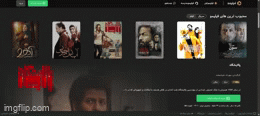

📺 Filimo Clone
✨ Project Description
Filimo Clone is a simple UI and functionality clone of the popular Iranian streaming service Filimo.
This project is built using:

- HTML
- CSS (Tailwind)
- JavaScript
- json-server

It simulates a basic video streaming platform with slider functionality and mock API data.

⚙️ Technologies Used

- HTML
- CSS (Tailwind)
- JavaScript
- Vite
- json-server
- Swiper.js (for slider)

🚀 How to Run the Project
1. Clone the Repository
git clone https://github.com/mobyna/Filimo-clone.git
2. Navigate to the Project Directory
cd Filimo-clone
3. Install Dependencies
npm install
4. Start the Mock API Server & Start the Front-End (Development Server)
npm start
This will start json-server on:
http://localhost:3001
and start the Vite server on:
http://localhost:5173
5. View the Project
Open your browser and go to:
http://localhost:5173
You should now see the Filimo Clone running with active sliders and data fetched from the mock API.

📁 API Endpoint:
GET http://localhost:3001/freeswiperslide
This API provides the mock data for the free slider section

🎯 Features
- Filimo-inspired design
- Responsive layout
- Dynamic sliders with Swiper.js
- Data fetched from json-server

🔗 Live Demo
Coming soon… (You can add this if you deploy it later)

## Inspired By

This project is inspired by [Filimo](https://www.filimo.com), a popular Iranian streaming platform.

